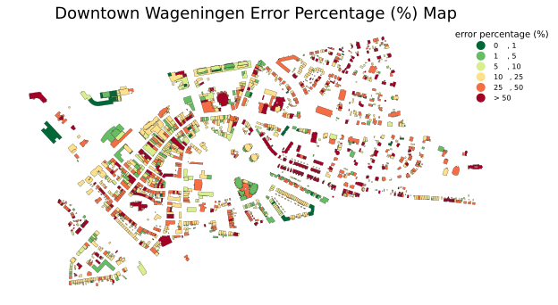

# **DREAMER:** Estimating Netherland's Building Heights 

> Using Digital Terrain Models (DTMs) & Digital Surface Models (DSMs) 🚀

Members: 🇳🇱 **Ruben Vos**, 🇬🇷 **Panagiotis Tsoutsouris**, 🇵🇱 **Kuba Kowalski**, 🇨🇳 **Xiaolu Yan**

## Demo (Downtown Wageningen)


`Downtown Wageningen 2d Map`


`Downtown Wageningen 3d Map`



`Downtown Wageningen Error Percentage (%) Map`

## Background

Accurate building height data is crucial for applications within multiple fields of science. For example, urban science can utilize this data to estimate noise propagation in order to implement measures which minimize the nuisance to residents in areas with heavy foot or cat traffic. Additionally, it may be used for solar and shading analysis which could give insight into the heat island effect where certain areas of a city experience much higher temperatures than others. By having building height data, it is possible for researchers to contribute towards cities that are more pleasant to live in for all of their residents.
However, up-to-date building height data is not always openly available for researchers. The most famous platform for obtaining open data about the urban environment, Open Street Map, provides height information only for 3% of its building footprint data (Sun, 2021). This is a significant challenge for researchers, professionals and hobbyists who aim to base their projects on open data derived from sources well known to the public. Additionally, the various methods of manually deriving building heights on a global scale are often inconvenient or require a level of expertise which cannot be expected from professionals or hobbyists who are not involved in geo-information science. For example, it is possible to derive building heights based on shadows in high resolution imagery, but this requires extensive programming knowledge or familiarity with software such as QGIS and ArcGIS Pro. Again, this cannot be expected from non-experts, and building height data and convenient methods to derive it should be made easily accessible for all interested parties.

## Objective and research questions

The objective of this project is to contribute towards the availability of open data in the built environment by developing a simple three-dimensional model of the urban environment in Wageningen, Netherlands using DEM and DTM datasets and validating them with building data from OSM. The script used to create the three-dimensional model will be made openly available on GitHub for review and use by other parties. The results of the model will be presented in a three-dimensional, interactive map.
Based on this objective, this main research question was formulated: How accurately is a simple three-dimensional model of the urban environment in Wageningen, Netherlands derived using open-source DEM and DTM datasets?
The secondary research questions are as follows:

What is the most suitable method to derive building heights using a three-dimensional model of an urban environment?
How accurate are the results of the method when validated using the existing datasets of building heights?

## Installation

To reproduce the result. First clone the repository, then create and activate environment. 

```Bash
# Clone the repository
git clone git@git.wur.nl:geoscripting-2024/staff/project/Project_Starter-dreamer_team.git

# Navigate to the project directory
cd Project_Starter-dreamer_team

# Install the required dependencies
mamba env create -f env.yaml
```

To activate environment

```Bash
source activate dreamer
```

Or

```Bash
conda activate dreamer
```

## Usage

Here we explain how to run the project and the purpose of each command. Include examples of how to execute the project.

Check the image below and select a neighborhood in Wageningen


```Bash
python Python/download_data.py
python Python/calculate_CHM.py
python Python/vis.py
python Python/evaluate.py
xdg-open output/
```

Above are the overall commands, and the detailed steps are below.

### 1. Download data

Provide instructions on how to download and prepare the data for the project.

```Bash
# Download data script
python Python/download_data.py
```

#### Example

```Bash
python Python/download_data.py
# Please enter the name of the municipality(case sensitive): `Wageningen`
# Please enter the number of the neighborhood you want: `31`

# Please enter the name of the municipality(case sensitive): `Amsterdam`
# Please enter the number of the neighborhood you want: `346`
```

### 2. Calculate building height

Describe how the calculation of building heights can be performed using the provided scripts. 

```Bash
# Calculate building heights
python Python/calculate_CHM.py
```

Formula that calculate $\text{CHM}$ is as follows. 

$$ \text{CHM} = \text{DSM} - \text{DTM}$$

### 3. Visualization

Provide details on how to generate 2D and 3D visualizations of the data.

```Bash
python Python/vis.py
```

To check the output folder via terminal. Use command follows.

```Bash
xdg-open output/
```

You can then manually click to open the `output html file`.

To open `output html file` via terminal, use `xdg-open` command. See example, replace `neighborhoodnameyouchoose` by the neighborhood chosen.

```Bash
xdg-open output/neighborhoodnameyouchoose/neighborhoodnameyouchoose_map_3d.html
```

### 4. Evaluation 

Explain how to evaluate the results. Provide examples of metrics used for evaluation.

Root Mean Squared Error (RMSE) is the index used to calculate the difference between estimated value and real value. The formula to calculate RMSE is as follows,

$$ \text{RMSE} = \sqrt{\frac{1}{n} \sum_{i=1}^{n} (y_i - \hat{y}_i)^2} $$

where  $n$ is the number of buildings, $y_i$ is the real building height value of $i\text{th}$ building, $\hat{y}_i$ is the estimated building height value of the $i\text{th}$ building, $\sum_{i=1}^{n}(y_i-\hat{y}_i)^2$ is the sum of squared errors for all building samples.

The formula can be simply described as: first calculate the error between the estimated value and the real value, then square these errors, then average all the squared errors, and finally take the square root.

```Bash
# Run evaluation script
python Python/evaluate.py
xdg-open output/
```

Open the  to explore `Evaluation` of downtown Wageningen. 


## Disclaimer 🤗 

There is a possibility that scripts may not work for areas outside Wageningen.

## References

### Article Reference

1. Sun, Yao (2021), Large-scale LoD1 Building Model Reconstruction from a Single SAR Image. Doctoral thesis. URL: https://elib.dlr.de/187104/2/1615447.pdf 

### Data References

1. **3D Basisvoorziening - 2D Objecten Gebouwen met hoogte attributen** Available at: https://api.pdok.nl/kadaster/3d-basisvoorziening/ogc/v1/collections/hoogtestatistieken_gebouwen Accessed October 8, 2024.
2. **Wijken en buurten in Wageningen** Available at: https://upload.wikimedia.org/wikipedia/commons/d/d1/WageningenBuurten2024v01_02.svg Accessed October 15, 2024.
3. **Toelichting Wijk- en Buurtkaart 2021, 2022 en 2023 | CBS
CBS, 2023** Available at: https://www.cbs.nl/nl-nl/longread/diversen/2023/toelichting-wijk-en-buurtkaart-2021-2022-en-2023?onepage=true Accessed October 7, 2024.
4. **DSM** Available at: https://service.pdok.nl/rws/ahn/atom/dsm_05m.xml Accessed October 6, 2024.
5. **DTM** Available at: https://service.pdok.nl/rws/ahn/atom/dtm_05m.xml Accessed October 6, 2024.

### Code References

1. **Creating 3D maps with MapLibre.** _Leafmap Package Documentation_ Available at: https://leafmap.org/notebooks/92_maplibre/#vancouver-property-value. Accessed October 11, 2024.
2. **root_mean_squared_error** _Scikit-learn Package Documentation_ Available at: https://scikit-learn.org/stable/modules/generated/sklearn.metrics.root_mean_squared_error.html Accessed October 11, 2024.
3. **Mapping and Data Visualization with Python (Full Course)** _Spatial Thoughts OpenCourseWare_ Available at: https://courses.spatialthoughts.com/python-dataviz.html Accessed October 11, 2024.


